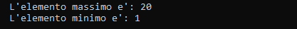

## Recursive search min-max

Implementazione ricorsiva dell'algoritmo di ricerca del valore minimo e 
del valore massimo all'interno di un vettore.

## Componenti della ricorsione
1. **Condizioni di terminazione:** `if(n <= 0)`
2. **Istruzione di terminazione:** `return min` - `return max`
3. **Passo di avvicinamento:** `n-1`
4. **Chiamata ricorsiva:** `return ricerca_min(v, n-1, min)` - `return ricerca_min(v, n-1, min)`

# Utilizzo
1. Crea in Code::Blocks un nuovo progetto.
2. Copia il codice sorgente.
3. Compila ed esegui.

# Codice sorgente
```cpp
#include <iostream>

int ricerca_max(int v[], int n, int max);
int ricerca_min(int v[], int n, int min);

int main(){
    int lung_vett = 20;
    int vett[lung_vett] = {1,2,3,4,5,6,7,8,9,10,11,12,13,14,15,16,17,18,19,20};
    int valore_minimo = vett[0];
    int valore_massimo = vett[0];

    std::cout << std::endl;
    std::cout << "\tL'elemento massimo e': " << ricerca_max(vett, lung_vett, valore_massimo);
    std::cout << std::endl;
    std::cout << "\tL'elemento minimo e': " << ricerca_min(vett, lung_vett, valore_minimo);
    std::cout << std::endl;

    return 0;
}

// la funzione ritorna:
// il valore massimo.
int ricerca_max(int v[], int n, int max){
    if(n <= 0)                          // condizione di terminazione: fine vettore
        return max;                     // istruzione di terminazione della ricorsione

    if (v[n-1] > max)                   // confronto l'elemento con max
        max = v[n-1];

    return ricerca_max(v, n-1, max);    // passo di avvicinamento + chiamata ricorsiva
}

// la funzione ritorna:
// il valore minimo.
int ricerca_min(int v[], int n, int min){
    if(n <= 0)                          // condizione di terminazione: fine vettore
        return min;                     // istruzione di terminazione della ricorsione

    if (v[n-1] < min)                   // confronto l'elemento con min
        min = v[n-1];

    return ricerca_min(v, n-1, min);    // passo di avvicinamento + chiamata ricorsiva
}
```

# Output


# Autore
Gabriele Henriet - [GitHub](https://github.com/Gabri-dev-C)

# Licenza
MIT License
